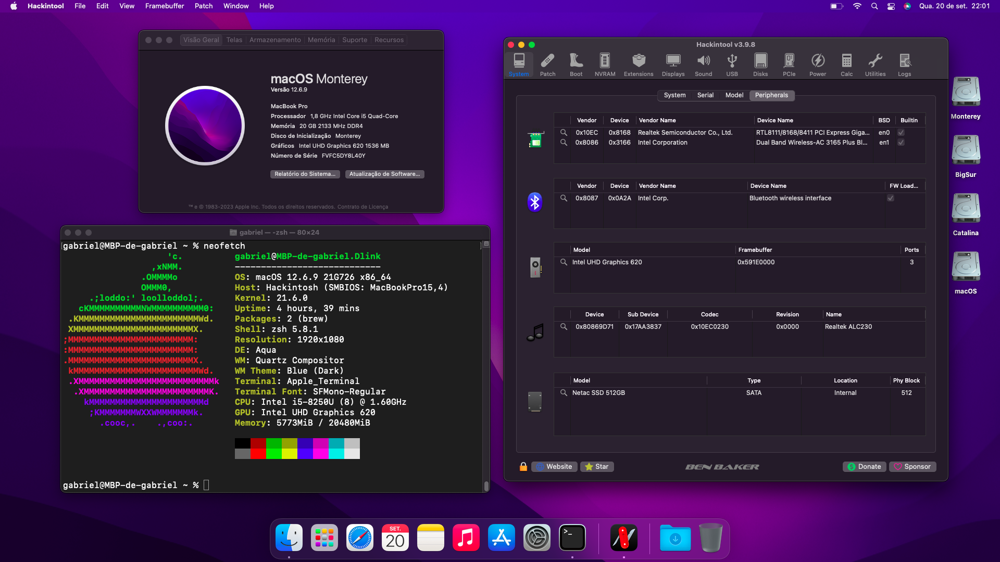
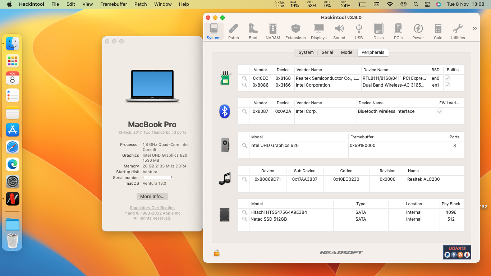

# EFI-IDEAPAD-330-15IKB-OPENCORE

:information_source: **The current version is fully macOS compatible based on my laptop hardware.**
OpenCore, drivers, and kexts are always up to date!

:information_source: The EFI's folder has 2 types: the Debug version that can be used for find errors on the boot/instalation and better logs. And a Relase version that is recommended for definitive use of the hackintosh.

:information_source: This efi has a hybrid configuration, which means that some kexts are dynamically loaded depending on the macOs (kernel) version. So you can choose the macOS version that better fit to your use.

:information_source: The EFI's have been tested on Catalina, BigSur, Moneterey and Ventura relases.

:information_source: The macOS Ventura is only supported on the OpenCore 0.8.3 or later releases

 

:warning: **IMPORTANT**

This is not a guide, please refer to [Dortania](https://dortania.github.io/getting-started) before doing anything. I am not responsible for any damage. This OpenCore configuration is optimized for my specific hardware, so please use it only as a reference or if you happen to have the same or similar hardware.

 

\*\* Working on all my [Releases](https://github.com/gabrielcasag/EFI-IDEAPAD-i5-8250U-330-15IKB-OPENCORE/releases) based on 

\*\* Working from  Release and newer

## :computer: Hardware:

| **Category** | **Component**                         |
| ------------ | ------------------------------------- |
| **CPU**      | 1.8GHz Intel Core i5-8250u            |
| **GPU**      | Intel UHD 620                         |
| **RAM**      | 20GB (4GB non-removable) 2133MHz DDR4 |
| **SSD**      | 512GB SATA SSD (Netac branded)        |
| **Display**  | 15,6" 1366x768p LCD non-touch display |
| **Wi-Fi/BT** | Intel Dual Band Wireless-AC 3165      |
| **Ethernet** | Realtek RTL8111                       |
| **Audio**    | Realtek ALC230 (layout-id=20)         |
| **Input**    | PS2 Keyboard & ELAN TrackPad          |

## :white_check_mark: Working:

- [x] CPU power management.
- [x] Graphics acceleration.
- [x] Battery read-out.
- [x] Keyboard & trackpad with all macOS gestures.
- [x] Wi-Fi.
- [x] Bluetooth.
- [x] USB ports.
- [x] HDMI video & audio output.
- [x] Ethernet.
- [x] Audio (Internal speakers, 3.5mm headphone jack).
- [x] Internal microphone.
- [x] VGA WebCam.
- [ ] AirDrop & Handoff.
- [x] iCloud & App Store.
- [x] iMessage & FaceTime.

## :x: Not working:

Only AirDrop and Handoff are not working since the Intel card are not fully compatible with macOS. To make these things works you need to replace with a native card one, like the Fenvi cards.

## :closed_lock_with_key: SMBIOS

You will need to generate your own SMBIOS and configure, since is required to fully work with macOS. As per this [guide](https://dortania.github.io/OpenCore-Install-Guide/config-laptop.plist/kaby-lake.html#platforminfo) you can use the following SMBIOS: MacbookPro 14,1.

Use [GenSMBIOS](https://github.com/corpnewt/GenSMBIOS) to generate your own unique SMBIOS and then copy each parametter following path (recomended to follow the guide above):

- Config.plist -> PlatformInfo -> Generic

## BIOS setup:

- Security / Intel Platform Trust Technology - Disabled
- Security / Intel SGX - Disabled
- Security / Secure Boot - Disabled
- Boot / Boot Mode - UEFI

## Credits:

[**Apple**](http://apple.com/)

[**Acidanthera**](https://github.com/acidanthera)

[**Dortania**](https://dortania.github.io/getting-started/)

[**Gabriel Luchina**](https://luchina.com.br)
